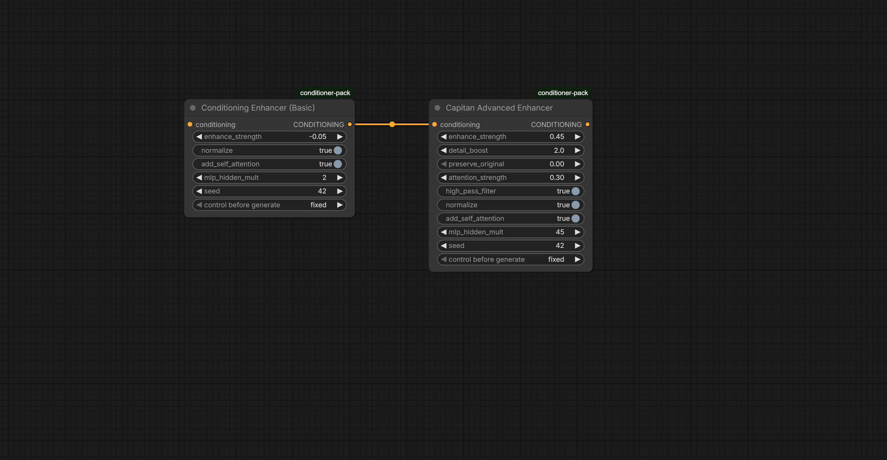

## Capitan Conditioning Enhancer (basic)
Lightweight post-processing node for Qwen3-4B conditioning in Z-Image Turbo workflows.
Refines the 2560-dim CONDITIONING from native Qwen3-4B text encoder with:

## Per-token normalization
Optional 8-head self-attention
2-layer MLP refiner (very wide hidden size supported)
Positive/negative blend strength

Improves coherence, detail retention, mood consistency, and prompt following.

## Installation
extract zip in ComfyUI/custom_nodes 

Or

git clone https://github.com/capitan01R/Capitan-ConditioningEnhancer.git

Or

Simply install via Comfyui Manager: Capitan-ConditioningEnhancer

restart ComfyUI or reload custom nodes

No dependencies.
## Placement
After CLIP Text Encode (Prompt) → before KSampler.

stack method:

## Grid examples:

Click to view full prompt

Close-up front-facing portrait of a cute innocent orange domestic house cat's head, perfectly vertically split down the center. Left half is a solid matte black domestic cat with short fur and one glowing yellow eye. Right half is a prehistoric saber-tooth tiger with thick white fur, bold grey stripes, massive thickened jaw, and one extremely long curved ivory saber tooth fully visible. The right half is slowly disintegrating into fine ethereal white dust and smoke particles drifting away, leaving a faint ghostly grey translucent shadow of the tiger shape behind. The cat's mouth is open in a soft mew, with the right-side teeth hazy and fading. Dark charcoal void background to highlight the dust particles and black fur. High detail, sharp contrast, surreal horror style, no blending between halves, tiger side remains fully distinct until the very end.

### Parameters Explained

| Parameter              | Type    | Default | Range             | What it does                                                                                       | Typical use / effect                                                                 |
|------------------------|---------|---------|-------------------|----------------------------------------------------------------------------------------------------|--------------------------------------------------------------------------------------|
| enhance_strength       | FLOAT   | 0.0     | -2.0 → 2.0        | Positive: add refinement, Negative: subtract refinement (sharper, anti-smoothing)                | 0.00–0.15 = subtle polish Negative = crisp/literal >0.5 = high risk            |
| normalize              | BOOLEAN | true    | true/false        | Per-token mean subtraction + unit variance normalization                                          | Almost always true — stability & cleaner generations                                 |
| add_self_attention     | BOOLEAN | false   | true/false        | Light 8-head self-attention across tokens (distant prompt parts influence each other)            | true = better cohesion & complex scene unity false = literal control              |
| mlp_hidden_mult        | INT     | 2       | 1 → 100           | Hidden layer width multiplier for MLP (2560 → 2560×mult → 2560)                                  | 2–10 = balanced 20–50 = hyper-literal detail (recommended max) 60–100 = extreme (low strength only) |

## MLP note — UI allows up to 100, but recommended max is 50. Higher rarely adds value and mostly increases artifact risk even at tiny strength (0.01–0.05).
Recommended Starting Points
Daily essential / stabilizer

strength: 0.00–0.10
normalize: true
add_self_attention: true
mlp_hidden_mult: 2–4

Hyper-literal detail mode (stacked)

First node: strength 0.05–0.10, normalize true, self-attn true, mult 2–4
Second node: strength 0.05–0.15 (or -0.05 – -0.15), normalize true, self-attn false, mult 40–50

Warnings
High strength (>0.4) + high mlp_hidden_mult + self-attention → rainbow artifacts / noise likely.
Very high mult (60+) needs extremely low strength (≤0.05).
Always test same seed first. Negative strength + high mult usually safer than positive.

-------------------------------------------------------------------------------------------------------------------

### Update: Added Capitan Advanced Enhancer (v1.0.1)

**The original Conditioning Enhancer (Basic)** remains completely untouched — only optional seed support was added for reproducible initialization (default 42).

New node added: **Capitan Advanced Enhancer** (experimental upgrade)

This node builds directly on the same core logic as the Basic (normalization → MLP refinement → blend → optional attention) but adds more controls for **maximum literal prompt adherence** and detail sharpness.

**Key new parameters**:

- **detail_boost** (FLOAT, range 0.0–4.0)  
  Amplifies high-frequency differences for sharper edges, textures, and fine details.  
  Optimal settings: 1.8–2.5

- **preserve_original** (FLOAT, range 0.0–1.0)  
  Stronger skip connection — mixes more raw original embeddings back in to anchor stability and prevent over-refinement at high mult.  
  Optimal settings: 0.35–0.50

- **attention_strength** (FLOAT, range 0.0–0.8)  
  Tunable control over self-attention mixing (only when add_self_attention = true).  
  Optimal settings: 0.0–0.1 (low/off for max literal)

- **high_pass_filter** (BOOLEAN)  
  Extra edge/detail emphasis by subtracting a low-pass (blurry) version from the refined embeddings.  
  Optimal settings: true

The node also includes built-in safety (clamping + dynamic residual scaling) to handle extreme `mlp_hidden_mult` (up to 100) without artifacts.

**Best use** — Stack after the Basic Enhancer:  
- Basic: gentle glue/stabilization (low mult, self-attn on)  
- Advanced: surgical literal boost (high mult, low strength, self-attn off)  

**Warning**: Start with very low `enhance_strength` (0.03–0.10) when using high `mlp_hidden_mult` (50–100) — over-refinement can cause noise or shifts. Always test same seed.

This update keeps the original Basic node unchanged (except for optional seed) and adds advanced control for users who want to push detail retention harder.

## Grid examples:

### Parameters Explained (Capitan Advanced Enhancer)

| Parameter              | Type    | Default | Range             | What it does                                                                                       | Typical use / effect                                                                 |
|------------------------|---------|---------|-------------------|----------------------------------------------------------------------------------------------------|--------------------------------------------------------------------------------------|
| enhance_strength       | FLOAT   | 0.05    | -3.0 → 2.0        | Positive: blends in the refined version (more detail), Negative: subtracts refinement (sharper, anti-smoothing) | 0.03–0.08 = max literal adherence (low to avoid over-processing) Negative = crisp/raw look >0.2 = high risk of noise |
| detail_boost           | FLOAT   | 1.5     | 0.0 → 4.0         | Amplifies high-frequency differences (sharp edges, textures, particles) after MLP refinement     | 1.8–2.5 = strong literal detail pop (stripes, tooth curve, dust) >3.0 = risk of halos/noise |
| preserve_original      | FLOAT   | 0.2     | 0.0 → 1.0         | Stronger skip connection — mixes more raw original embeddings back in to anchor stability        | 0.35–0.50 = prevents collapse/over-refinement at high mult 0.0 = full advanced power |
| attention_strength     | FLOAT   | 0.2     | 0.0 → 0.8         | Controls self-attention mixing strength (only when add_self_attention = true)                    | 0.0–0.1 = max crisp/literal (off) 0.2–0.4 = subtle cohesion >0.5 = smoothing risk |
| high_pass_filter       | BOOLEAN | true    | true/false        | Subtracts low-pass (blurry) version to emphasize high-frequency edges/details                    | true = extra sharpness (tiger jaw/tooth/dust distinct) false = if halos appear |
| normalize              | BOOLEAN | true    | true/false        | Per-token mean subtraction + unit variance normalization                                         | Almost always true — stability & cleaner generations                                 |
| add_self_attention     | BOOLEAN | false   | true/false        | Light 8-head self-attention across tokens (distant prompt parts influence each other)            | false = max literal control true = better scene unity (use low attention_strength) |
| mlp_hidden_mult        | INT     | 50      | 1 → 100           | Hidden layer width multiplier for MLP (2560 → 2560×mult → 2560)                                  | 50–100 = hyper-literal detail (sweet spot ~70) 2–10 = balanced (like basic node) |
| seed                   | INT     | 42      | 0 → 2147483647    | Fixed seed for reproducible MLP/attention initialization (same seed = same refinement every run) | Any fixed number for consistency — change for different "flavors" |

